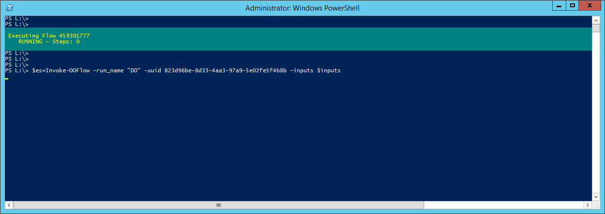

### OO Powershell

## Pre-Requisites
Powershell

## Clone
Clone the repository using GIT.

## Load

```
PS L:\powershell\oo-powershell\OperationsOrchestrationPowershell\OperationsOrchestrationPowershell> Import-Module -Force .\OperationsOrchestrationPowershell.psd1

```

## Login

```powershell 
PS L:\powershell\oo-powershell\OperationsOrchestrationPowershell\OperationsOrchestrationPowershell> Connect-OO -base_url https://dev-hpoo.domain.com:8443/oo/rest

cmdlet Connect-OO at command pipeline position 1
Supply values for the following parameters:
credentials
User: ps_admin
Password for user ps_admin: *****

Logged Into https://dev-hpoo.domain.com:8443/oo/rest as ps_admin. OO_URL and OO_TOKEN have been exported to the environment
@{version=10.60 - Enterprise Edition; revision=c0304cf4577137dfd63bcc7edbc7517763fa14aa; build ID=27; build number=27; build job name=10-60-Release}
PS L:\powershell\oo-powershell\OperationsOrchestrationPowershell\OperationsOrchestrationPowershell>
```

## Examples

### Get VERSION

```
PS L:\> OO GET /version


version        : 10.60 - Enterprise Edition
revision       : c0304cf4577137dfd63bcc7edbc7517763fa14aa
build ID       : 27
build number   : 27
build job name : 10-60-Release
```


### Execute Flow
```
$inputs= New-Object PSObject -Property @{'itr_source_ip'='10.33.44.45';
		'itr_target_ip'='10.21.23.24';
		'itr_target_port'='3128';
		'itr_email_address'='dimiter.todorov@domain.com'}

$flow_payload = New-Object PSObject -Property @{'flowUuid'='823d96be-8d33-4aa3-97a9-5e02fe5f4b8b';
            'runName'='PortTest - From Powershell';
            'logLevel'='EXTENDED';
            'inputs'=$inputs}

$flow_json = $flow_payload | ConvertTo-Json

OO POST /latest/executions $flow_json
459301278
```

### Execute Flow Synchronously
```
$inputs= New-Object PSObject -Property @{'itr_source_ip'='10.33.44.45';
		'itr_target_ip'='10.21.23.24';
		'itr_target_port'='3128';
		'itr_email_address'='dimiter.todorov@domain.com'}

$es=Invoke-OOFlow -run_name "DD" -uuid 823d96be-8d33-4aa3-97a9-5e02fe5f4b8b -inputs $inputs
```



### Flow Results

```
PS L:\> $es


executionId      : 459301777
branchId         :
startTime        : 1464629779849
endTime          : 1464629798225
status           : COMPLETED
resultStatusType : RESOLVED
resultStatusName : success
pauseReason      :
cancelReason     :
owner            : ps_admin
ownerDomain      : Internal
triggeredBy      : Internal\ps_admin
flowUuid         : 823d96be-8d33-4aa3-97a9-5e02fe5f4b8b
flowPath         : Library/ITR/Utility Flows/ITR - Run Port Test.xml
executionName    : PortTest - From Powershell
triggeringSource : central
roi              : 0.0


PS L:\>
```


